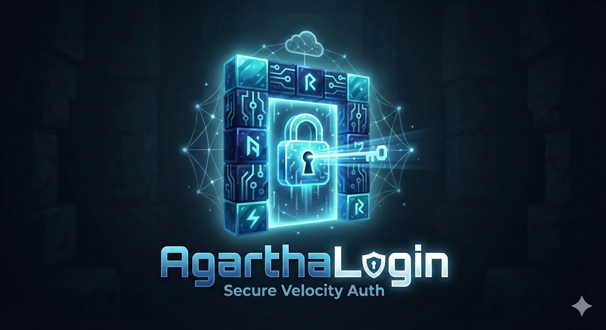

# AgarthaLogin 🔐


<p align="center">
  
  <br>
  <sup>Logo generated by Google Gemini AI</sup>
</p>

AgarthaLogin is a **high-performance, secure authentication system** designed for modern Minecraft networks. It replaces legacy in-game commands `/login` with a secure, web-based authentication flow. It is the most "production-ready" auth plugin available for Velocity servers.

Built for **scalability** and **production deployments**, it features:
*   **Zero-Impact Scalability**: Offloads unauthenticated players to a lightweight "Limbo" server, protecting your main backend from bot attacks and login waves.
*   **Modern Cryptography**: Uses **Argon2ID** hashing and supports **TOTP 2FA** native integration.
*   **Seamless UX**: A **frictionless** web flow that supports **browser autofill** and keeps passwords hidden, ensuring users feel safer. Includes native **Geyser/Floodgate** support.
*   **Premium Auto-Login**: Automatically detects and validates **Premium Minecraft** accounts (no password required), while securing cracked/offline players.
*   **Universal Compatibility**: Runs on **Velocity** proxies with support for multi-proxy synchronization via **Redis**.

> [!IMPORTANT]
> AgarthaLogin prevents passwords from being compromised with [a proper HTTPS setup](./docs/EXPOSING_AUTH.md), but it **does not encrypt in-game connection** (TCP).
>
> *   **Just want encryption?**  
>     Use [OfflineEncryptor](https://modrinth.com/plugin/offlineencryptor) with your existing auth plugin.
> *   **Want better auth UX?**  
>     Use AgarthaLogin (we recommend using it *alongside* [OfflineEncryptor](https://modrinth.com/plugin/offlineencryptor) for maximum security).

> [!NOTE]
> This project is a fork of [LibreLogin](https://github.com/kyngs/LibreLogin), heavily modified for production use and enhanced with web capabilities.

## ✨ Features

| Feature | Description |
|---------|-------------|
| 🌐 **Web Authentication** | One-time links, React UI, session persistence |
| 🔒 **BCrypt Hashing** | Industry-standard password security |
| 👑 **Premium AutoLogin** | Automatic authentication for Mojang accounts |
| 🛡️ **Admin Panel** | Web-based user management interface |
| 🔄 **Session Management** | Token-based auth with configurable timeouts |

### Platform Support
- ✅ **Velocity 3.x** (1.21+)
- ✅ **Paper** (1.21+)
- ✅ **Docker** — production-ready compose setup
- ✅ **Geyser/Floodgate** — [Bedrock support](https://github.com/Navio1430/LibreLoginProd/wiki/Floodgate)
- ❌ **BungeeCord** — not supported

## 📚️ Tech Stack

**Backend**: Java 21, Jetty (embedded web server)  
**Frontend**: Vite + React + TypeScript  
**Database**: MySQL/MariaDB/PostgreSQL/SQLite

### API Endpoints
| Endpoint | Purpose |
|----------|---------|
| `/api/check-token` | Validate login token |
| `/api/login` | Authenticate credentials |
| `/api/register` | Create new account |
| `/api/session-auth` | Verify active session |
| `/api/admin/*` | Admin panel operations |

## 📦 Quick Start

> **New to AgarthaLogin?** Check out the [Getting Started Guide](./docs/GETTING_STARTED.md).

```bash
# Build
./gradlew shadowJar

# Deploy to Velocity plugins folder
# Configure config.conf (ensure web port is open)
# Restart proxy
```

For containerized deployments, see `.compose/docker-compose.yaml`.

## 👥 Credits

- **vuxeim** — Support for newest Minecraft versions
- **LibreLogin creators** — Original base plugin ([LibreLogin](https://github.com/kyngs/LibreLogin)).

## 📄 License

[Mozilla Public License 2.0](LICENSE)