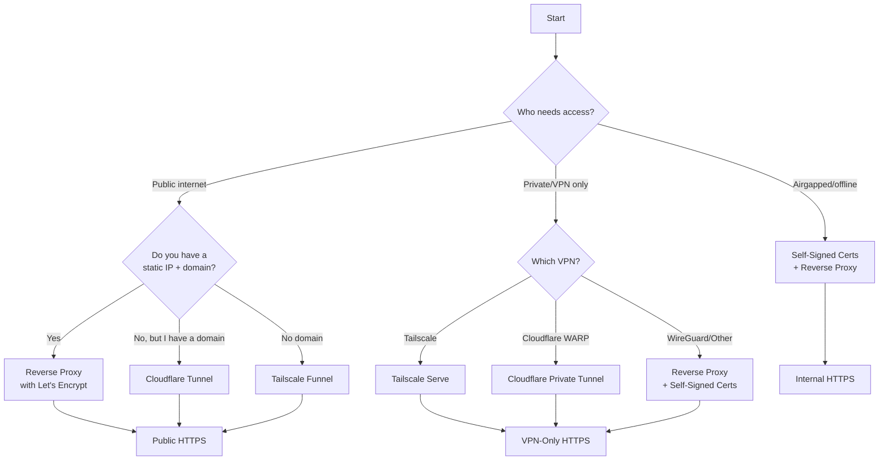

# Exposing Web Authentication

This guide covers best practices for securely exposing AgarthaLogin's web authentication endpoint, including TLS setup, HTTP-to-HTTPS redirects, and environment-specific configurations.

---

## Which Option Should I Choose?



| Scenario | Recommended Option | Requirements |
|----------|-------------------|--------------|
| **Public** with static IP + domain | Reverse Proxy (Nginx/HAProxy) | Ports 80/443 open, SSL cert |
| **Public** without static IP | Cloudflare Tunnel | Domain on Cloudflare |
| **Public** without domain | Tailscale Funnel | Tailscale account |
| **Private** Tailscale network | Tailscale Serve | All users on Tailnet |
| **Private** Cloudflare network | Cloudflare Private Tunnel | All users on WARP client |
| **Private** other VPN | Reverse Proxy + self-signed | VPN configured |
| **Airgapped** / offline | Reverse Proxy + self-signed | Local network only |

> [!NOTE]
> **Tailscale Funnel Limitations**: Only ports **443**, **8443**, and **10000** are available for public TCP.
> 
> **Headscale Alternative**: If self-hosting Tailscale via [Headscale](https://github.com/juanfont/headscale), you'll need port forwarding like a traditional reverse proxy setup.

---

## Option 1: Reverse Proxy

Best for environments where you control the network and can manage certificates.

### Prerequisites (Public Internet)

1. **Domain**: Point your domain (e.g., `auth.yourdomain.com`) to your server's IP.
2. **Firewall**: Open ports 80 and 443 (`ufw allow 80,443/tcp`).
3. **Port Forwarding**: If behind a router, forward ports 80 and 443 to your server.
4. **SSL Certificate**: Obtain from [Let's Encrypt](https://letsencrypt.org/) (free).

### Prerequisites (Private/Airgapped)

For VPN-only or airgapped networks, you can skip domain and Let's Encrypt requirements:

1. **Local DNS or IP**: Use a local hostname (e.g., `auth.local`) or direct IP.
2. **Self-Signed Certificate**: Generate your own (see below).

### Self-Signed Certificate (Private/Airgapped)

```bash
# Example command to create a certificate valid for 1 year
openssl req -x509 -nodes -days 365 -newkey rsa:2048 \
  -keyout /etc/ssl/private/agartha.key \
  -out /etc/ssl/certs/agartha.crt \
  -subj "/CN=auth.local" \
  -addext "subjectAltName=DNS:auth.local,IP:192.168.1.100"
```

Replace `192.168.1.100` with your server's local IP.

> [!IMPORTANT]
> Players must add the self-signed certificate to their browser's trusted store, or they will see security warnings. Distribute the `.crt` file for users to install as a trusted CA.

---

### 1A. Nginx (Host)

Create `/etc/nginx/sites-available/agartha-auth`:

```nginx
server {
    listen 80;
    server_name auth.yourdomain.com;  # Or auth.local for private
    return 301 https://$host$request_uri;
}

server {
    listen 443 ssl http2;
    server_name auth.yourdomain.com;  # Or auth.local for private

    # For Let's Encrypt (public):
    ssl_certificate /etc/letsencrypt/live/auth.yourdomain.com/fullchain.pem;
    ssl_certificate_key /etc/letsencrypt/live/auth.yourdomain.com/privkey.pem;

    # For self-signed (private/airgapped):
    # ssl_certificate /etc/ssl/certs/agartha.crt;
    # ssl_certificate_key /etc/ssl/private/agartha.key;

    location / {
        proxy_pass http://127.0.0.1:8080;
        proxy_set_header Host $host;
        proxy_set_header X-Real-IP $remote_addr;
        proxy_set_header X-Forwarded-For $proxy_add_x_forwarded_for;
        proxy_set_header X-Forwarded-Proto $scheme;
    }
}
```

Enable and reload:
```bash
ln -s /etc/nginx/sites-available/agartha-auth /etc/nginx/sites-enabled/
nginx -t && systemctl reload nginx
```

### 1B. Nginx (Docker Compose)

Add an Nginx sidecar to your existing compose file:

```yaml
services:
  # Your existing proxy service (e.g., Velocity)
  proxy:
    image: itzg/mc-proxy:latest
    # ... your existing config ...
    networks:
      - agartha-net

  nginx:
    image: nginx:alpine
    ports:
      - "80:80"
      - "443:443"
    volumes:
      - ./nginx-agartha.conf:/etc/nginx/conf.d/default.conf:ro
      - ./certs:/etc/ssl/certs:ro  # For self-signed, or /etc/letsencrypt for Let's Encrypt
    networks:
      - agartha-net
    depends_on:
      - proxy

networks:
  agartha-net:
```

Create `nginx-agartha.conf` (note: `proxy_pass` points to the service name):
```nginx
server {
    listen 80;
    server_name auth.yourdomain.com;
    return 301 https://$host$request_uri;
}

server {
    listen 443 ssl http2;
    server_name auth.yourdomain.com;

    ssl_certificate /etc/ssl/certs/agartha.crt;
    ssl_certificate_key /etc/ssl/certs/agartha.key;

    location / {
        proxy_pass http://proxy:8080;  # 'proxy' is the Docker service name
        proxy_set_header Host $host;
        proxy_set_header X-Real-IP $remote_addr;
        proxy_set_header X-Forwarded-For $proxy_add_x_forwarded_for;
        proxy_set_header X-Forwarded-Proto $scheme;
    }
}
```

### 1C. HAProxy (Host)

Add to `/etc/haproxy/haproxy.cfg`:

```haproxy
frontend http_redirect
    bind *:80
    http-request redirect scheme https code 301

frontend https_front
    bind *:443 ssl crt /etc/haproxy/certs/combined.pem
    http-request set-header X-Forwarded-Proto https
    default_backend agartha_backend

backend agartha_backend
    server agartha 127.0.0.1:8080 check
```

> [!NOTE]
> Combine your certs: `cat fullchain.pem privkey.pem > /etc/haproxy/certs/combined.pem`
> For self-signed: `cat agartha.crt agartha.key > /etc/haproxy/certs/combined.pem`

### 1D. HAProxy (Docker Compose)

Add an HAProxy sidecar with a **complete** config file:

```yaml
services:
  proxy:
    image: itzg/mc-proxy:latest
    # ... your existing config ...
    networks:
      - agartha-net

  haproxy:
    image: haproxy:alpine
    ports:
      - "80:80"
      - "443:443"
    volumes:
      - ./haproxy.cfg:/usr/local/etc/haproxy/haproxy.cfg:ro
      - ./certs:/etc/haproxy/certs:ro
    networks:
      - agartha-net
    depends_on:
      - proxy

networks:
  agartha-net:
```

Create `haproxy.cfg` (**complete file**, not a snippet):
```haproxy
global
    log stdout format raw local0
    maxconn 4096

defaults
    mode http
    log global
    option httplog
    timeout connect 5s
    timeout client 30s
    timeout server 30s

frontend http_redirect
    bind *:80
    http-request redirect scheme https code 301

frontend https_front
    bind *:443 ssl crt /etc/haproxy/certs/combined.pem
    http-request set-header X-Forwarded-Proto https
    default_backend agartha_backend

backend agartha_backend
    server agartha proxy:8080 check  # 'proxy' is the Docker service name
```

---

## Option 2: Tailscale

Best for bypassing CGNAT, avoiding port forwarding, or private VPN-only access.

### Access Modes

| Mode | Audience | Requirements |
|------|----------|--------------|
| **Serve** | Tailnet users only | All players must have Tailscale installed |
| **Funnel** | Public internet | ACL configuration, limited to ports 443/8443/10000 |

### Prerequisites

1. Install Tailscale on your server: [tailscale.com/download](https://tailscale.com/download)
2. Enable **MagicDNS** and **HTTPS Certificates** in [Admin Console → DNS](https://login.tailscale.com/admin/dns)
3. Allow traffic to port 8080 on the Tailscale interface:
   ```bash
   ufw allow in on tailscale0 to any port 8080
   ```

### 2A. Tailscale Serve (Private VPN)

Access only for devices on your Tailnet. **All players must have Tailscale installed.**

```bash
tailscale serve 8080
```

Your URL: `https://your-machine.tail-name.ts.net`

### 2B. Tailscale Funnel (Public)

Access from the public internet without port forwarding.

```bash
tailscale funnel 8080
```

> [!IMPORTANT]
> **Funnel Limitations:**
> - Only ports **443**, **8443**, and **10000** are available for public TCP
> - Requires ACL configuration (see below)
> 
> Add this to your [Tailscale ACLs](https://login.tailscale.com/admin/acls):
> ```json
> {
>   "nodeAttrs": [
>     {
>       "target": ["tag:server"],
>       "attr": ["funnel"]
>     }
>   ]
> }
> ```
> Then tag your machine: `tailscale up --advertise-tags=tag:server`

### 2C. Headscale (Self-Hosted)

If using [Headscale](https://github.com/juanfont/headscale) instead of Tailscale's control plane, Funnel is not available. Use **Option 1 (Reverse Proxy)** with port forwarding instead.

### 2D. Tailscale (Docker Compose)

Add a Tailscale sidecar that shares its network with your Velocity proxy:

```yaml
services:
  tailscale:
    image: tailscale/tailscale:latest
    hostname: agartha-auth
    cap_add:
      - NET_ADMIN
      - SYS_MODULE
    devices:
      - /dev/net/tun:/dev/net/tun
    environment:
      TS_AUTHKEY: tskey-auth-XXXXX  # Generate at admin.tailscale.com/settings/keys
      TS_EXTRA_ARGS: --advertise-tags=tag:server
      TS_SERVE_CONFIG: /config/serve.json
    volumes:
      - tailscale-state:/var/lib/tailscale
      - ./tailscale-serve.json:/config/serve.json:ro

  proxy:
    image: itzg/mc-proxy:latest
    network_mode: service:tailscale  # Share Tailscale's network
    depends_on:
      - tailscale
    environment:
      TYPE: VELOCITY
      # ... your existing config ...
    volumes:
      - proxy-data:/server

volumes:
  tailscale-state:
  proxy-data:
```

Create `tailscale-serve.json`:
```json
{
  "TCP": {
    "443": {
      "HTTPS": true
    }
  },
  "Web": {
    "agartha-auth.tail-name.ts.net:443": {
      "Handlers": {
        "/": {
          "Proxy": "http://127.0.0.1:8080"
        }
      }
    }
  }
}
```

---

## Option 3: Cloudflare Tunnel

Best for users already on Cloudflare, or who want free TLS without opening ports.

### Access Modes

| Mode | Audience | Requirements |
|------|----------|--------------|
| **Public Tunnel** | Public internet | Domain on Cloudflare |
| **Private Tunnel** | WARP users only | All players must use Cloudflare WARP client |

### Prerequisites

1. A Cloudflare account with your domain added
2. [Install cloudflared](https://developers.cloudflare.com/cloudflare-one/connections/connect-apps/install-and-setup/installation/)

> [!NOTE]
> **No domain?** You cannot use Cloudflare Tunnel for public access without a domain. Use **Tailscale Funnel** instead.

### 3A. Cloudflare Tunnel (Host)

**Step 1: Create a tunnel**
```bash
cloudflared tunnel login
cloudflared tunnel create agartha-auth
```

**Step 2: Configure the tunnel**

Create `~/.cloudflared/config.yml`:
```yaml
tunnel: agartha-auth
credentials-file: /root/.cloudflared/<TUNNEL_ID>.json

ingress:
  - hostname: auth.yourdomain.com
    service: http://localhost:8080
  - service: http_status:404
```

**Step 3: Add DNS record**
```bash
cloudflared tunnel route dns agartha-auth auth.yourdomain.com
```

**Step 4: Enable HTTP to HTTPS redirect**

In [Cloudflare Dashboard](https://dash.cloudflare.com/) → your domain → **SSL/TLS** → **Edge Certificates**:
- Enable **Always Use HTTPS**

Alternatively, add a Page Rule: `http://*yourdomain.com/*` → **Always Use HTTPS**

**Step 5: Run the tunnel**
```bash
cloudflared tunnel run agartha-auth
```

### 3B. Cloudflare Private Tunnel (WARP Only)

For VPN-only access where all players use the **Cloudflare WARP client**:

1. In [Cloudflare Zero Trust](https://one.dash.cloudflare.com/), create a private network tunnel
2. Configure your tunnel to only be accessible to authenticated WARP users
3. Players install WARP and authenticate with your team

> [!IMPORTANT]
> This requires all players to install and authenticate with the WARP client. It's best for controlled environments (e.g., private servers with known players).

### 3C. Cloudflare Tunnel (Docker Compose)

Add a cloudflared sidecar:

```yaml
services:
  proxy:
    image: itzg/mc-proxy:latest
    # ... your existing config ...
    networks:
      - agartha-net

  cloudflared:
    image: cloudflare/cloudflared:latest
    command: tunnel run
    environment:
      TUNNEL_TOKEN: <your-tunnel-token>  # Get from Cloudflare Zero Trust dashboard
    networks:
      - agartha-net
    depends_on:
      - proxy
    restart: unless-stopped

networks:
  agartha-net:
```

> [!TIP]
> Get your tunnel token from:
> [Cloudflare Zero Trust](https://one.dash.cloudflare.com/) → Networks → Tunnels → Create a tunnel → Choose "Cloudflared" → Copy the token.

---

## Option 4: Kubernetes Gateway API

For enterprise environments using the Tailscale Kubernetes Operator.

### Prerequisites

1. [Install Tailscale Operator](https://tailscale.com/kb/1236/kubernetes-operator)
2. Configure [Split DNS](https://tailscale.com/kb/1620/kubernetes-operator-byod-gateway-api) for custom domains

### Gateway Manifest

```yaml
apiVersion: gateway.networking.k8s.io/v1
kind: Gateway
metadata:
  name: agartha-gateway
  annotations:
    tailscale.com/hostname: auth.yourdomain.com
spec:
  gatewayClassName: tailscale
  listeners:
    - name: https
      protocol: HTTPS
      port: 443
      hostname: auth.yourdomain.com
---
apiVersion: gateway.networking.k8s.io/v1
kind: HTTPRoute
metadata:
  name: agartha-route
spec:
  parentRefs:
    - name: agartha-gateway
  rules:
    - backendRefs:
        - name: velocity-proxy
          port: 8080
```

---

## Verifying Your Setup

After configuration, update `config.conf`:

```hocon
web-server {
    enabled = true
    port = 8080
    public-url = "https://auth.yourdomain.com"  # Your HTTPS URL
    # For private/airgapped: "https://192.168.1.100" or "https://auth.local"
}
```

Test by visiting your URL in a browser. You should see the AgarthaLogin authentication page.